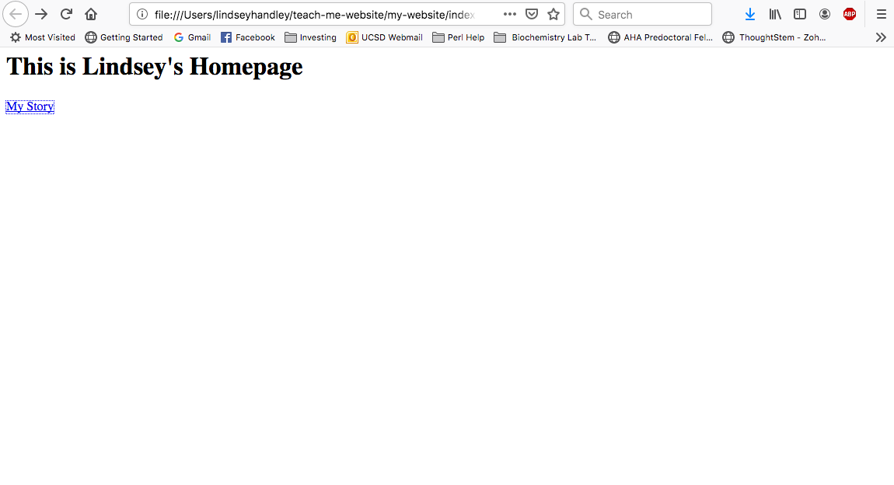
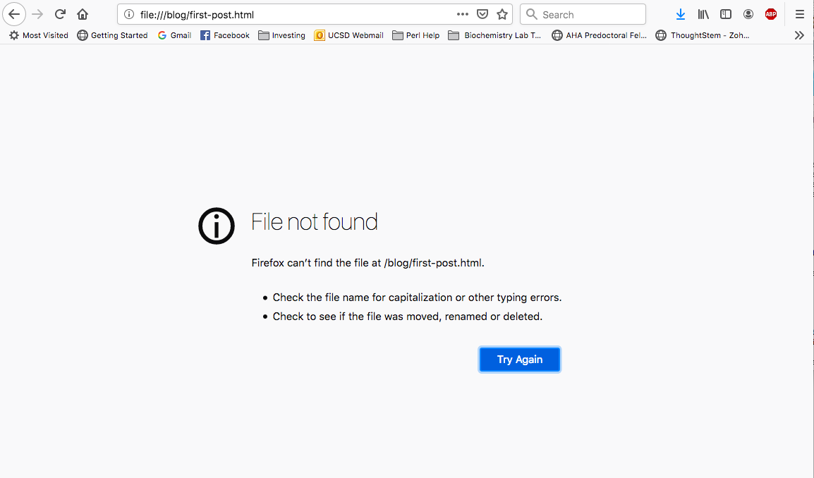
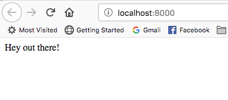

# teach-me-website

> **Student**: Can you teach me how to make a website?

**Teacher**: Why do you want to make a website?

> **Student**: I want to make a new blog website for myself.

**Teacher**: What's the mission of the blog? 

> **Student**: To have a place where people can learn about me and read about my story. I want a blog to help build a personal brand. 

**Teacher**: How many pages will you have, and what will their names be?

> **Student** To start, I want a homepage called "Lindsey Handley" that links to at least 1 blog post called "My Story". 

**Teacher**: Okay, let's put a prototype together.  Install the `website` package from https://github.com/thoughtstem/website.  Look at the `my-site.rkt` demo, and copy something like that into this repo to express how your homepage and post link up.

> **Student**: I wasn't able to install website through the Package Manager. But I added a `my-website.rkt` file to the repository. I'm getting the following error when I try to install the website directory in Package Manager: `Users/lindseyhandley/Dev/website/scribblings/website.scrbl:3:20: module: identifier already required for label
  at: time
  in: racket/base`

**Teacher**: I'd like to fix that before we go on.  Can you pull my recent changes to the `website` package, then run `raco setup website` and see if you still get an error?

> **Student**: It installed without errors this time!

**Teacher**: Nice!  Thanks for helping me fix that.  Now, what's next?  Is your blog project finished? 

> **Student**: How do I use the `my-website.rkt` file to generate the HTML and display that in my browser?

**Teacher**:  Ah, I see in `my-website.rkt` you're defining a site.  To produce the html, you call `(render ...)` on your site.  See the `website` docs, generate your site html.

> **Student**: Awesome! It looks like that worked. Now I can open up the `index.html` file, but the "My Story" link takes me to a broken page right now. Did I do something wrong?

**Teacher**: Can you post a screenshot please? 

> **Student**: Sure! Here's the homepage:

> And here's the first blog post:

**Teacher**: It's the absolute links between pages in the site get interpreted by the browser as links to the root of the filesystem.  You need to run a webserver in the same directory where you're rendering your project.  I just added a `raco website-preview` command you can use for that purpose, if you update your `website` package again.

> **Student**: When I run `raco website-preview` inside the `my-website` directory, it open up a page that isn't part of my blog I think:

**Teacher**: Looks like I gave you a broken tool.  Can you update `website` and try the previewer again?
